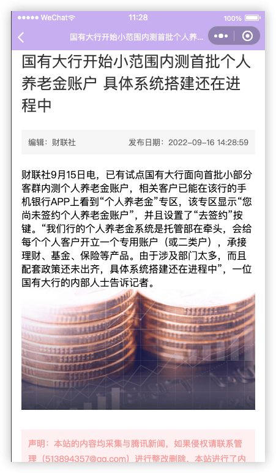

news
---

uniapp简单案例项目

## 预览





## 接口说明

> 该接口为免费试用接口，带宽有限，请勿恶意请求！！ 

### 获取新闻栏目

https://ku.qingnian8.com/dataApi/news/navlist.php

返回值
```json
[
    {
        "id": "50",
        "classname": "国内"
    },
    {
        "id": "51",
        "classname": "国际"
    }
    ..........
]
```

### 获取新闻列表
https://ku.qingnian8.com/dataApi/news/newslist.php


参数名介绍是否必填cid栏目id必填num获取的条数非必填page页码非必填


返回值
参数名介绍idid唯一标识title标题picurl缩略图地址posttime发布时间classid栏目idauthor作者hits阅读量

```json
[
    {
        "id": "232",
        "title": "谷歌vs反垄断：“消灭”Cookie计划将延至2024年",
        "picurl": "http://qingnian8.oss-cn-qingdao.aliyuncs.com/images/20220729/1659113387.png",
        "posttime": "1659105841",
        "hits": "339",
        "classid": "53",
        "author": "腾讯新闻"
    },
    {
        "id": "231", 
        "title": "华为又“撞上”苹果，巅峰对决如何延续？", 
        "picurl": "http://qingnian8.oss-cn-qingdao.aliyuncs.com/images/20220729/1659112918.jpg", 
        "posttime": "1659105680",
        "hits": "658",
        "classid": "53",
        "author": "侠客岛"
    }
]
```


### 获取新闻详情

https://ku.qingnian8.com/dataApi/news/detail.php

| **参数名** | **介绍**   | **是否必填** |
| ---------- | ---------- | ------------ |
| cid        | 栏目id     | 必填         |
| id         | 当前新闻id | 必填         |


返回值

| **参数名** | **介绍**   |
| ---------- | ---------- |
| id         | id唯一标识 |
| title      | 标题       |
| picurl     | 缩略图地址 |
| posttime   | 发布时间   |
| classid    | 栏目id     |
| author     | 作者       |
| hits       | 阅读量     |
| content    | 详情内容   |


## 打包

配置项文件：`manifest.json`，用于定义应用的元数据、启动图标、背景颜色、默认页面、应用程序的名称、图标、版本等信息。

打包文件位置：`unpackage/dist`

### 1 H5或PC版本


### 2 微信小程序版本


### 3 App
